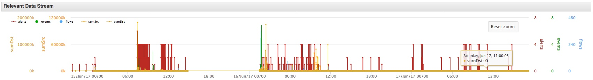
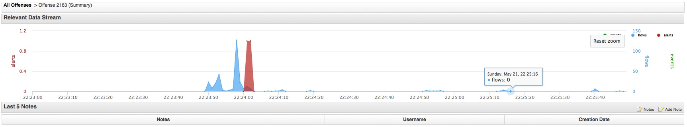

# QRDS
Relevant data stream for the offende summary pages

v1.2
added flow size for src and dst.
Alert is now a spline graph
known issue : may hang on firefox when disabling a series by clicking on the label

v1.1
initial release

